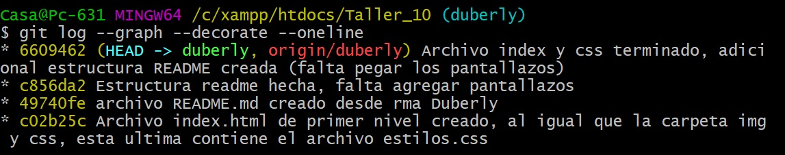
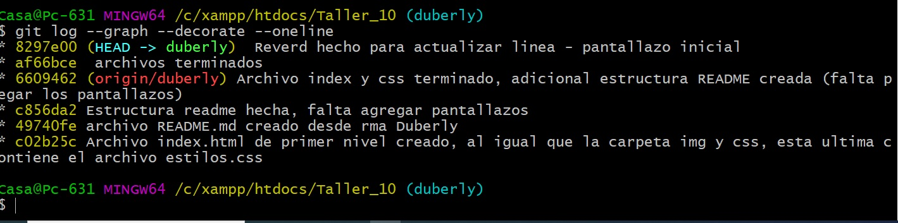
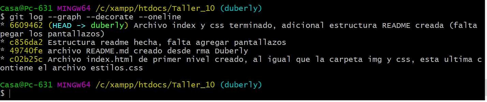
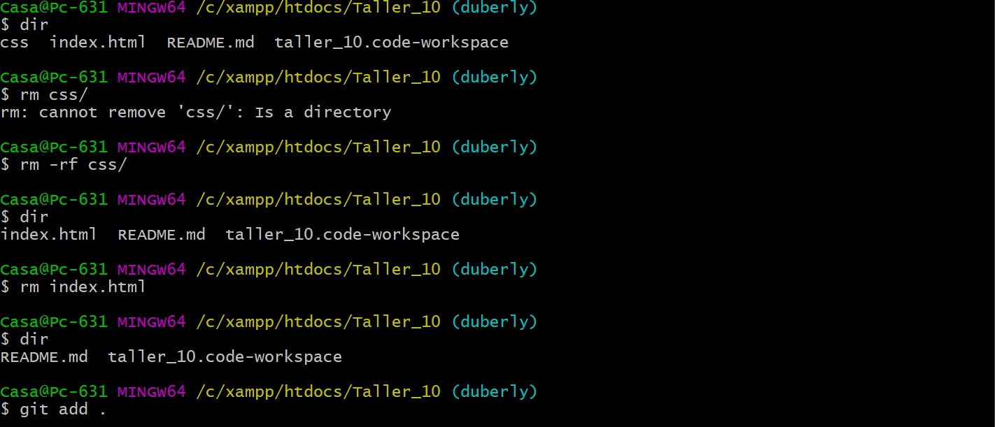
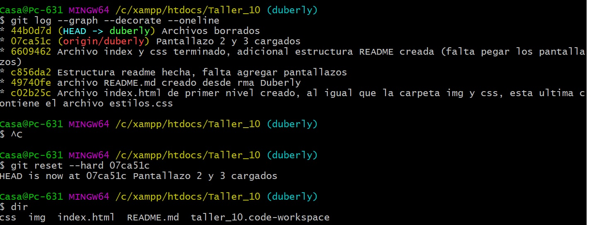

# TRABAJO COLABORATIVO
## Duberly Camacho y James García
### Clase Bictia del 25 de junio de 2020    

## PANTALLAZOS TALLER #10 DESDE LA RAMA DUBERLY
1. Pantallazo "primeros commits" (antes de reset y revert)

2. Pantallazo revert

3. Pantallazo git reset --soft

4. Pantallazo Commit borrando todos los archivos 

5. Pantallazo Reset --hard  recuperando archivos

## PANTALLAZOS TALLER #10 DESDE LA RAMA JAMES